# Lieflat Charts

[中文](README.md) | English

Lieflat Charts is an Agent Skills-compatible data visualization skill for moxt, Claude Code, Codex, and other AI agents that support `SKILL.md`. Created at [moxt.ai](https://moxt.ai), it turns datasets into polished, readable visual stories that can stand alone or form a complete editorial page.

Its visual language is built around a consistent monochrome palette, typography, spacing, line work, and motion system. It includes three main chart families:

- **Lupi Editorial**: fine lines, dot fields, record-level detail, annotations, and generous whitespace for papers, long-form articles, annual reports, and slow-reading data stories.
- **Glance**: bold bars, large numbers, blocks, and clear ranking for reports, dashboards, and situations where readers need the answer in seconds.
- **Lupi Basics**: familiar bar, line, area, donut, and scatter silhouettes rebuilt with countable units, hairlines, and editorial typography.

The skill also includes standalone interactive visualizations for networks, paths, and dense multi-segment flows. Each chart aims to preserve honest data units while treating headlines, annotations, sources, and page structure as part of the visualization.

Charts default to a black, white, and gray palette. When a user explicitly requests color, or color represents a real data dimension, the skill can start from Porcelain, Palm, or Wire. These presets provide a stable first draft, not a locked palette: users can refine the colors after generation while preserving structure, contrast, and data meaning.

## Preview

Representative templates from each chart family.

### Lupi Editorial

Detailed, record-level, and editorial. Selected examples from 15 narrative templates.

<table>
  <tr>
    <td width="50%">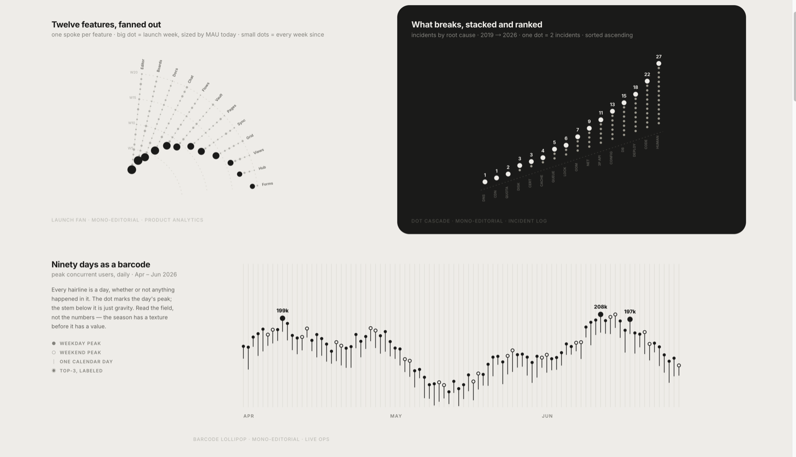</td>
    <td width="50%">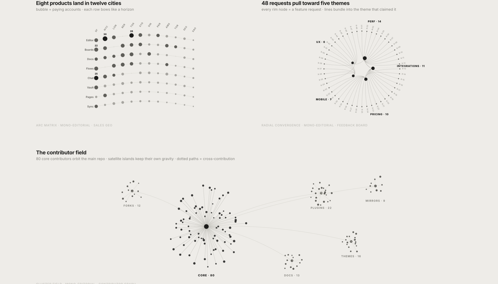</td>
  </tr>
  <tr><td colspan="2"></td></tr>
</table>

### Glance

Fast reading, pre-aggregated information, and conclusion-first composition. Selected examples from 18 Glance templates.

<table>
  <tr>
    <td width="50%">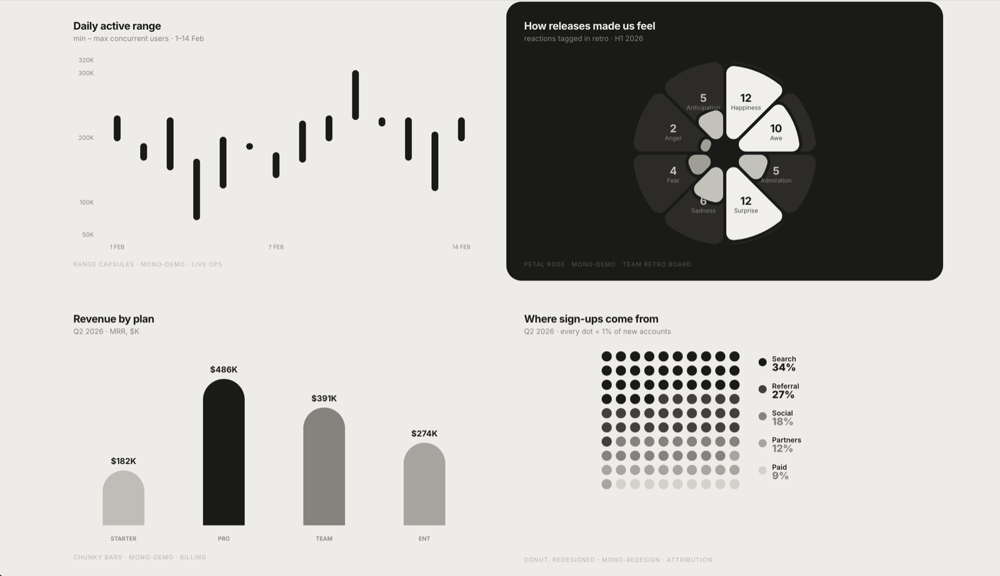</td>
    <td width="50%">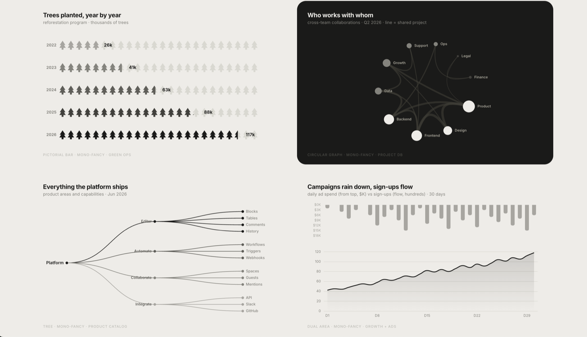</td>
  </tr>
  <tr><td colspan="2"></td></tr>
</table>

Motion preview:

<p align="center">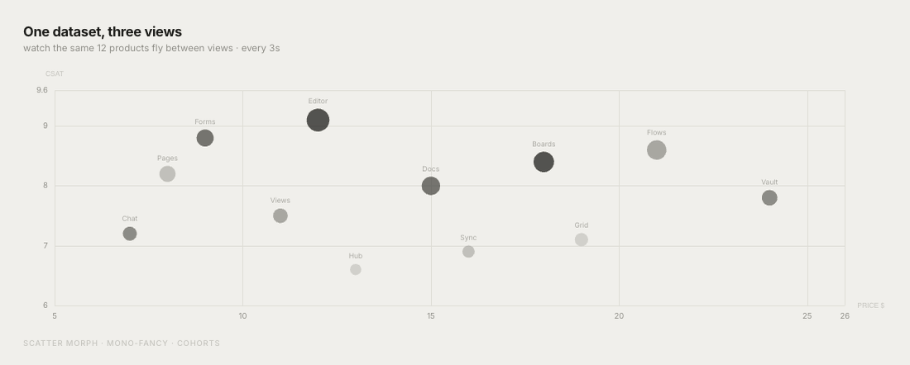</p>

More motion examples:

<table>
  <tr>
    <td width="33%"><br><strong>Fifty markets</strong></td>
    <td width="33%"><br><strong>Eight products race</strong></td>
    <td width="33%">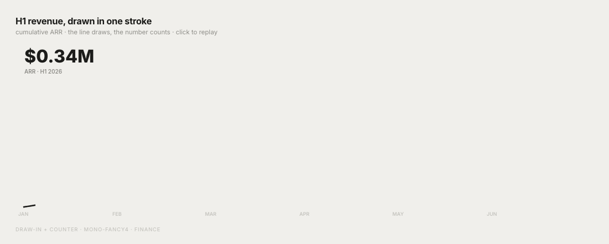<br><strong>H1 revenue</strong></td>
  </tr>
</table>

### Lupi Basics

Familiar chart forms built from countable visual units. Selected examples from 12 foundational templates.

<table>
  <tr>
    <td width="50%">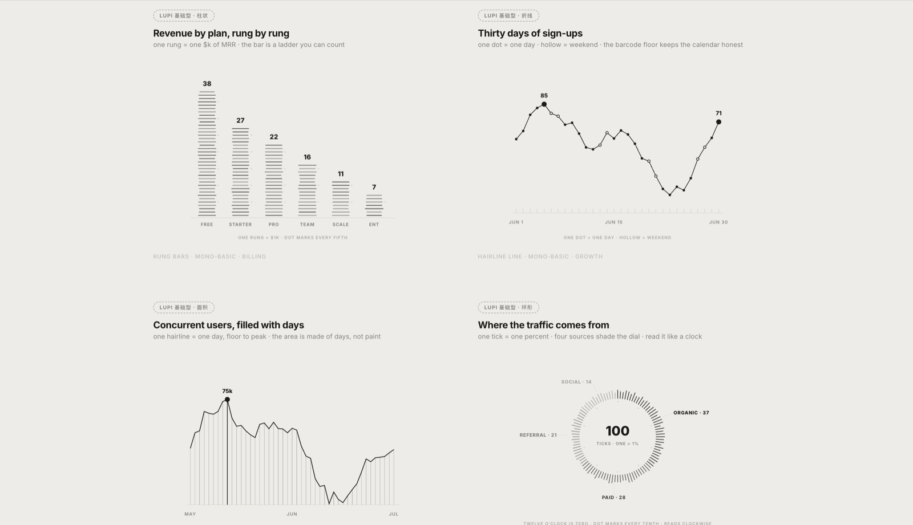</td>
    <td width="50%">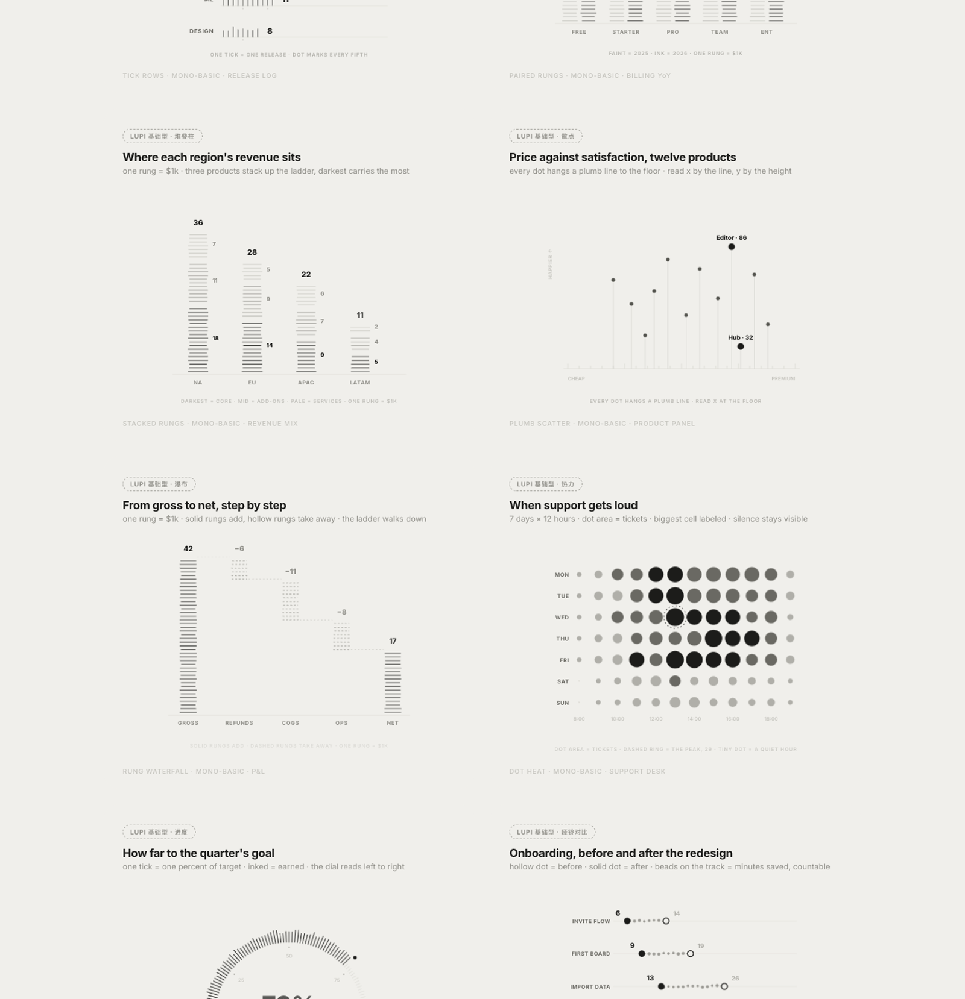</td>
  </tr>
</table>

### Interactive

For networks, paths, and high-density relationship data.

Motion preview:

<p align="center">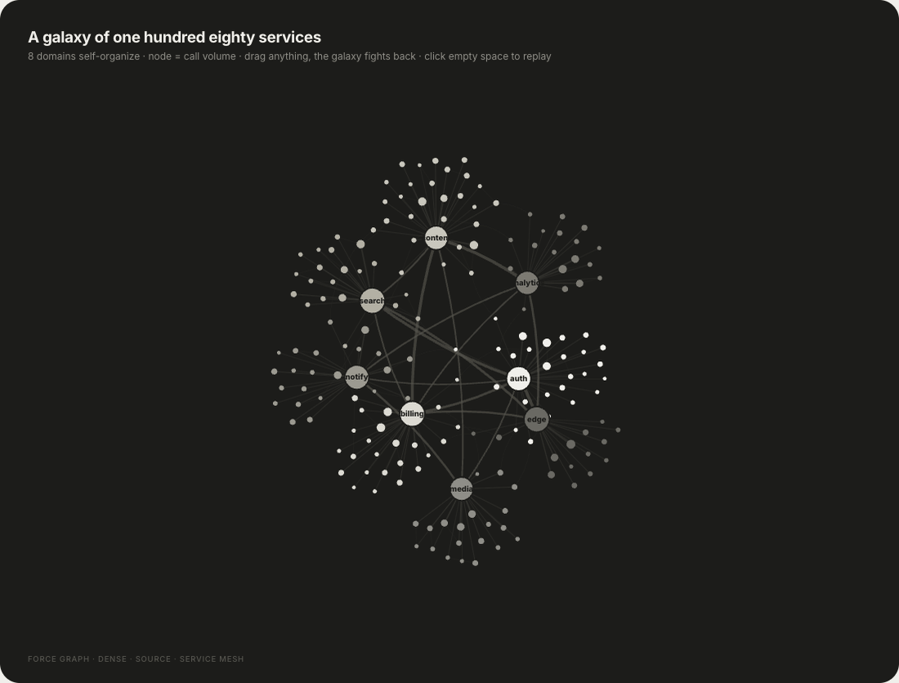</p>

[Open the Force Graph template to try dragging and zooming](https://larashero3-dotcom.github.io/lieflat-charts/templates/big-force.html)

## Latest Update: 2026.8.6

### Added Color Mode

Charts default to black, white, and gray, with three color preset families available when color is useful. If a user explicitly requests color, or color itself represents a real data dimension, the first draft starts from one preset to keep the palette coherent. The presets are not locked: colors can be refined after generation, with contrast, visual hierarchy, and data meaning checked again after each change.

#### Porcelain

A single-hue blue scale for ordered data and single-series charts.

<table>
  <tr>
    <td width="50%">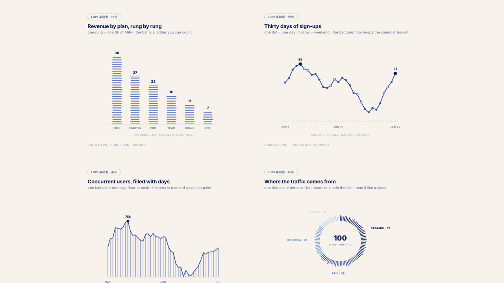<br><strong>Basics</strong></td>
    <td width="50%">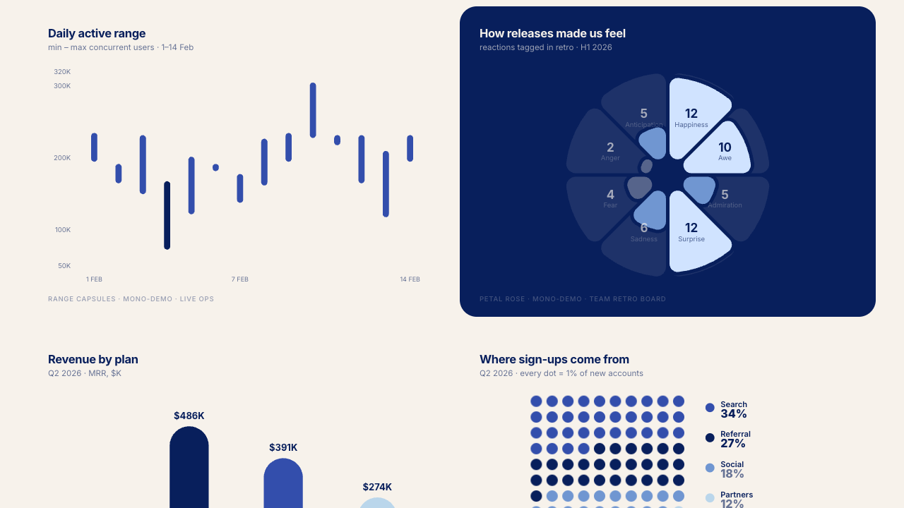<br><strong>Glance</strong></td>
  </tr>
  <tr><td colspan="2">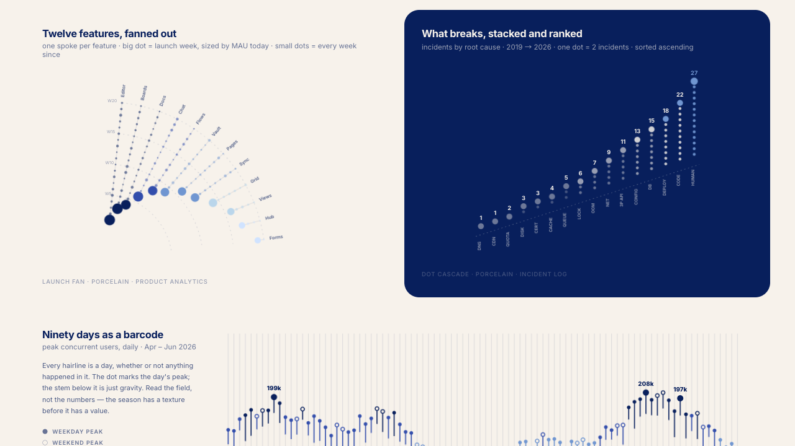<br><strong>Lupi Editorial</strong></td></tr>
</table>

#### Palm

A low-saturation green and yellow family for a small number of unordered categories.

<table>
  <tr>
    <td width="50%">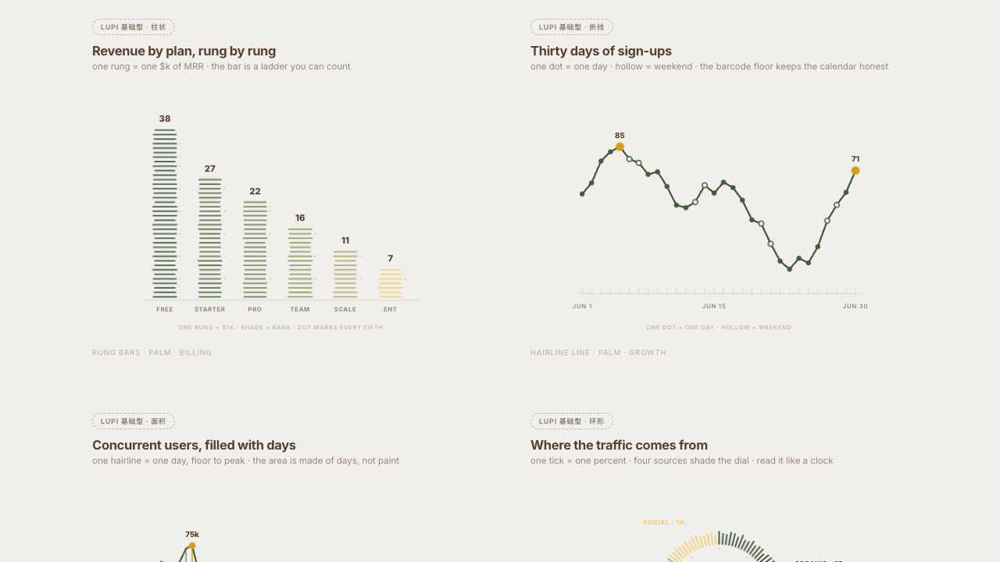<br><strong>Basics</strong></td>
    <td width="50%">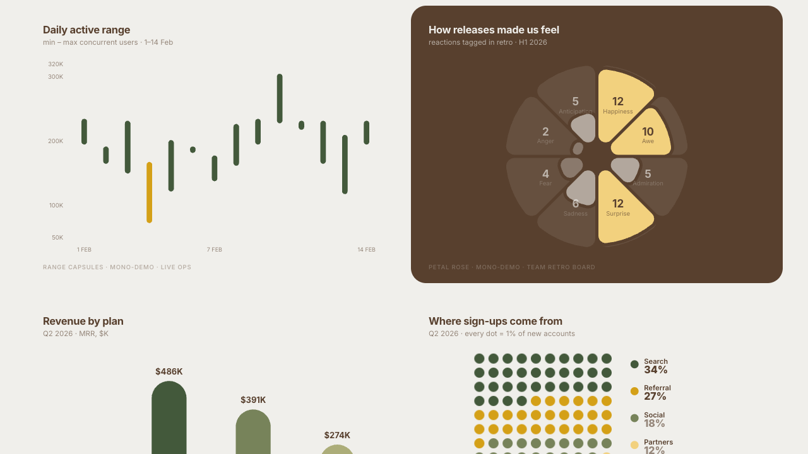<br><strong>Glance</strong></td>
  </tr>
  <tr><td colspan="2">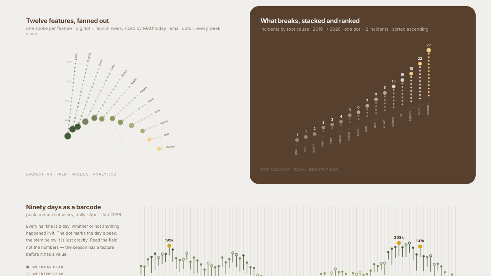<br><strong>Lupi Editorial</strong></td></tr>
</table>

#### Wire

A black and gray palette with one fluorescent orange focal point.

<table>
  <tr>
    <td width="50%"><br><strong>Basics</strong></td>
    <td width="50%">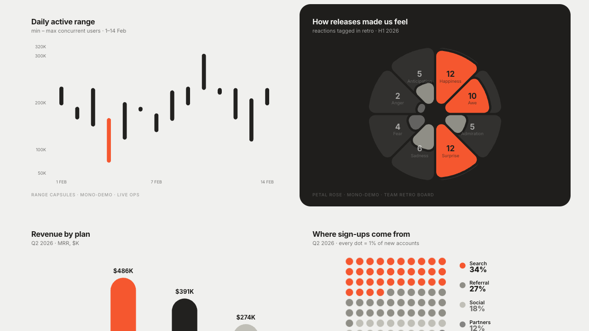<br><strong>Glance</strong></td>
  </tr>
  <tr><td colspan="2"><br><strong>Lupi Editorial</strong></td></tr>
</table>

## Quick Start

Install with one command:

```bash
npx skills add https://github.com/larashero3-dotcom/lieflat-charts --skill lieflat-charts
```

You can also send the following instruction to an AI agent with shell access:

```text
Install lieflat-charts. Clone https://github.com/larashero3-dotcom/lieflat-charts
to ~/.claude/skills/lieflat-charts, then verify that SKILL.md, templates/,
catalog.md, and mono-tokens.js are present.
```

For Codex, replace the installation path with `~/.codex/skills/lieflat-charts`.

To update an existing installation:

```text
Update lieflat-charts. Enter ~/.claude/skills/lieflat-charts, run git pull,
and report the latest commit.
```

After installation, ask your agent:

```text
Turn this research dataset into five charts for a long-form article.
Compare Lupi Editorial and Lupi Basics first. Use Glance only if neither group fits.
```

More prompt examples:

```text
Use lieflat-charts to turn this dataset into a color chart.
```

```text
Read this paper, identify the strongest data findings, and build a complete HTML chart page.
```

```text
This is weekly reporting data. Make the ranking, changes, and anomalies readable within ten seconds.
```

```text
Turn this CSV into a Glance chart suitable for a presentation.
```

```text
Redesign this dataset in the Lupi style, preserving every real record and adding useful annotations.
```

```text
Rebuild this chart with the Porcelain preset. Use lightness to represent value without changing the structure.
```

The number of charts follows the number of independent findings: one chart for one question, two or three charts for two or three findings, and four to six charts for a complete article or paper. A single page defaults to no more than six charts, and repeated conclusions are removed rather than added to meet a quota.

## Templates

| Family | Count | Best for | Implementation |
|---|---:|---|---|
| **Lupi Editorial** | 15 | Annual reports, papers, long-form articles, posters, portfolios, and readers willing to inspect detail | Handwritten SVG |
| **Lupi Basics** | 12 | Bars, lines, areas, donuts, scatterplots, waterfalls, heatmaps, progress, and other foundational data shapes | Handwritten SVG |
| **Glance** | 18 | Weekly reports, dashboards, monitoring, and presentations that require fast comparison | Chart.js / ECharts |
| **Interactive** | 3 | Networks, paths, multi-segment flows, and high-density relationship data | ECharts / SVG |
| **Color Presets** | 3 families / 15 samples | Distinguishing real data dimensions or adding one controlled focal point to monochrome charts | Restyled original templates |

### Lupi Editorial

Each point, line, and annotation should map to a real unit whenever possible. Lupi Editorial does not rush to aggregate the evidence into a single number. It lays out records, distributions, structures, and exceptions through hairlines, whitespace, ledger-like guides, annotations, and low-contrast value scales.

### Lupi Basics

Lupi Basics retains familiar chart silhouettes while rebuilding them inside the same editorial language. A cell can represent one percentage point, a tick can represent one person, and a hairline can represent one day. It is suited to smaller datasets that still need density and countable visual units.

### Glance

Glance pre-aggregates information, strengthens the main forms, and places the key ranking or change in the first visual pass. It is not a simplified Lupi mode. It serves a different reading speed: readers can identify what is higher, what changed most, and what needs attention within seconds.

### Interactive

Interactive templates handle relationship data that ordinary static charts cannot carry. Hover, focus, dragging, pinned paths, and status readouts turn complex networks into records that can be queried one by one. Interaction is reserved for real data, not decorative elements.

## Design

Every family shares the same core visual language: paper gray and charcoal at the extremes, a controlled grayscale ladder between them, and data encoded through lightness, position, length, density, and structure. The three color presets provide stable starting points. When users refine the palette, contrast, hierarchy, and data meaning still need to remain clear.

Lieflat Charts differs from a conventional chart generator in more than color:

- It identifies the data contract before choosing a chart.
- Each chart carries one independent conclusion before charts are assembled into a page.
- Real data units become visual atoms instead of using decorative noise to imitate density.
- Headlines, annotations, sources, spacing, and motion are treated as part of the chart.
- Lupi and Glance represent different reading speeds, not simply static versus interactive output.

## Structure

```text
.
├── README.md                # Chinese project guide
├── README.en.md             # English project guide
├── SKILL.md                 # Agent workflow and design rules
├── catalog.md               # Data-contract index for 48 chart types
├── mono-tokens.js           # Shared monochrome design tokens
├── color-presets.js         # Three built-in color presets
├── templates/               # Lupi, Basics, Glance, and interactive templates
│   └── color/               # Color-restyled samples
├── examples/                # Examples based on public datasets
├── docs/assets/             # README screenshots and motion previews
└── scripts/validate.mjs     # Pre-release validation
```

Open the HTML files under `templates/` directly to inspect the galleries. Lupi and Basics mainly use native SVG. Glance, Circular, and Force templates load Chart.js or ECharts from a CDN and require an internet connection unless those dependencies are inlined.

## License

This project is licensed under the [PolyForm Noncommercial License 1.0.0](LICENSE). Learning, modification, sharing, and noncommercial use are allowed. Commercial use requires separate permission.

Chart.js, Apache ECharts, and the Inter typeface remain subject to their original licenses. See [THIRD_PARTY_NOTICES.md](THIRD_PARTY_NOTICES.md).
